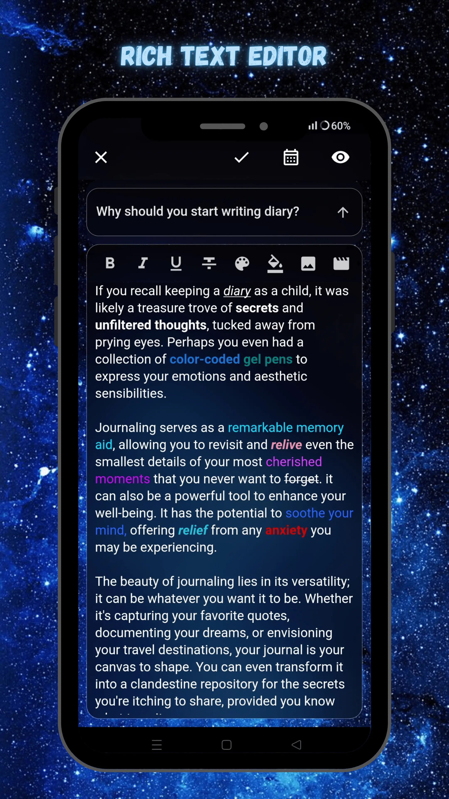
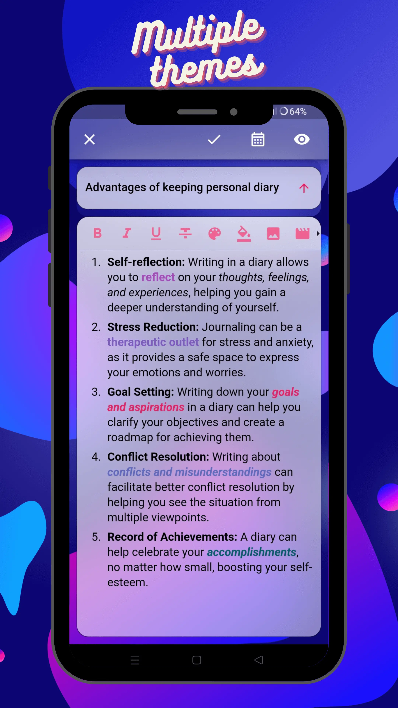
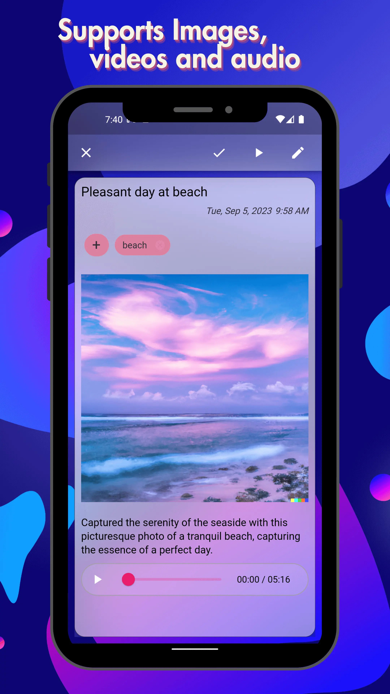
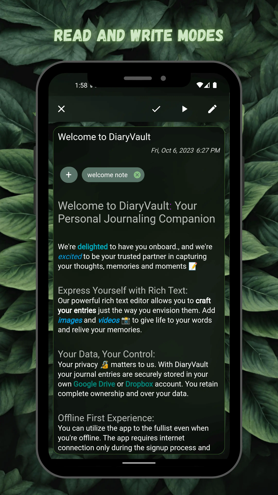
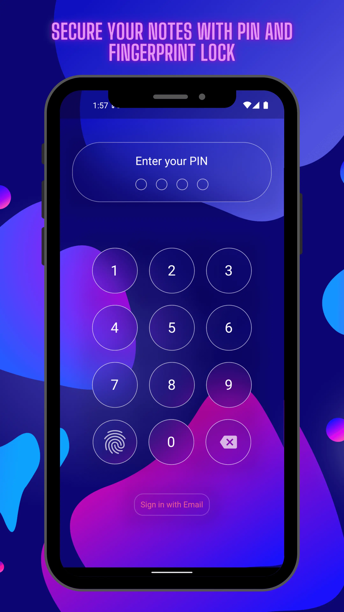
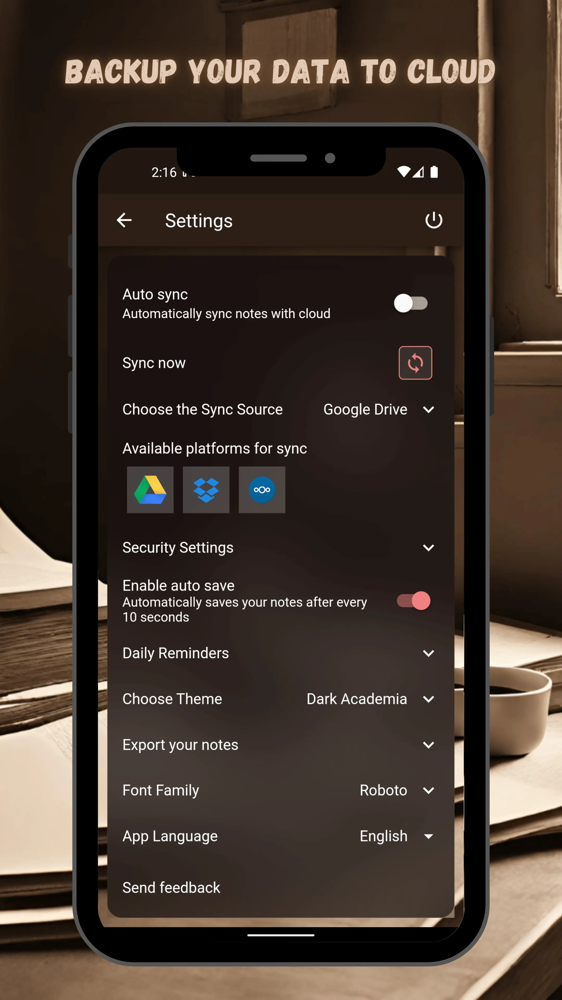
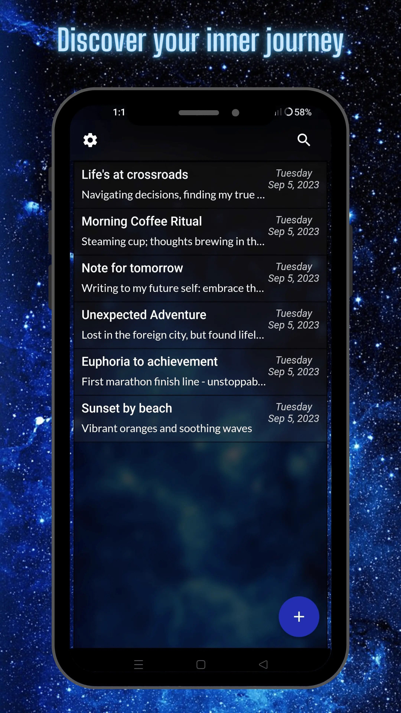

# Diary Vault

**A FOSS, offline first personal diary application written in Flutter**

<div>
  <a href="https://play.google.com/store/apps/details?id=me.sankethbk.dairyapp">
    
  </a>
</div>

<div>
  <a href="https://apt.izzysoft.de/fdroid/index/apk/me.sankethbk.dairyapp/">
    
  </a>
</div>

## Key Features

1. Rich text editor with support for images and videos
2. Your data is securely preserved on your Google Drive / Dropbox account, ensuring complete ownership and privacy
3. Sync data between multiple devices
4. Notes can be organized by attaching tags
5. Notes can be exported to text files and PDF files
6. Secure your notes with PIN and Fingerprint lock
7. Daily reminder notifications to stay on track with writing
8. Multiple Themes and languages

## Libraries used

1. [Flutter bloc](https://bloclibrary.dev) for state management
2. [FlutterQuill](https://pub.dev/packages/flutter_quill) for rich text editor
3. [Flutter Local Auth Invisible](https://pub.dev/packages/flutter_local_auth_invisible) for fingerprint login
4. [Dartz](https://pub.dev/packages/dartz) for functional programming
5. [SQFLite](https://pub.dev/packages/sqflite) as local database

### Screenshots

<div style="display:flex; flex-wrap: wrap;">
  
  
  
  
  
  
  
  
</div>


### Motivation for building this app

As someone who enjoys writing in a diary, I've tried out many diary apps on Google Play.
Through my own experiences and by reading what others have shared in their reviews, I've gained a better understanding of the issues that current diary apps face.

* Requires premium subscription for seemingly simple features
* Lack of proper authentication: In some cases, users have to enter their password every time they log in, as there is no support for fingerprint authentication
* Ads are the last thing you want to encounter while writing; just picture yourself composing a thought-provoking entry, and an ad suddenly appears, disrupting your train of thought
* No support for images
* No automatic saving: People don't want to lose their lengthy notes just because they ran out of battery, received a phone call or clicked on a notification
* No font customization for overall app and individual note level
* No customizable sorting: Not everyone wants to sort by date

🌟 **If you like what we're building, please consider starring our repository on GitHub to show your support. It means a lot to us!** ⭐

### Feature Roadmap Table

* Adding OneDrive and Nextcloud as cloud backup sources.
* Add support for embedding audio files in rich text editor
* A simple todolist within the rich text editor
* Support for embedding audio files
* Organizing notes in the form of folders

### Multi-Language Support
DiaryVault is available in multiple languages. Following is the status of translation to different languages

[English](https://github.com/SankethBK/diaryvault/blob/master/lib/l10n/intl_en.arb) is the primary language

| Language | Translation Status 
|----------|-------------------
| [Arabic](https://github.com/SankethBK/diaryvault/blob/master/lib/l10n/intl_ar.arb) | Incomplete
| [Bahasa](https://github.com/SankethBK/diaryvault/blob/master/lib/l10n/intl_id.arb) | Incomplete
| [Chinese](https://github.com/SankethBK/diaryvault/blob/master/lib/l10n/intl_zh.arb) | Complete
| [English](https://github.com/SankethBK/diaryvault/blob/master/lib/l10n/intl_en.arb) | Primary
| [Finnish](https://github.com/SankethBK/diaryvault/blob/master/lib/l10n/intl_fi.arb) | Incomplete
| [French](https://github.com/SankethBK/diaryvault/blob/master/lib/l10n/intl_fr.arb) | Complete
| [German](https://github.com/SankethBK/diaryvault/blob/master/lib/l10n/intl_de.arb) | Complete
| [Gujarati](https://github.com/SankethBK/diaryvault/blob/master/lib/l10n/intl_gu.arb) | Incomplete
| [Hebrew](https://github.com/SankethBK/diaryvault/blob/master/lib/l10n/intl_he.arb) | Incomplete
| [Hindi](https://github.com/SankethBK/diaryvault/blob/master/lib/l10n/intl_hi.arb) | Complete
| [Kannada](https://github.com/SankethBK/diaryvault/blob/master/lib/l10n/intl_kn.arb) | Incomplete
| [Panjabi](https://github.com/SankethBK/diaryvault/blob/master/lib/l10n/intl_pa.arb) | Incomplete
| [Polish](https://github.com/SankethBK/diaryvault/blob/master/lib/l10n/intl_pl.arb) | Complete
| [Portuguese (Brazil)](https://github.com/SankethBK/diaryvault/blob/master/lib/l10n/intl_pt.arb) | Complete
| [Spanish](https://github.com/SankethBK/diaryvault/blob/master/lib/l10n/intl_es.arb) | Complete
| [Swahili](https://github.com/SankethBK/diaryvault/blob/master/lib/l10n/intl_sw.arb) | Incomplete
| [Telugu](https://github.com/SankethBK/diaryvault/blob/master/lib/l10n/intl_te.arb) | Complete

To add missing translations or new language, refer to [this issue](https://github.com/SankethBK/diaryvault/issues/75).

### Support

If you have any questions or doubts, join our [Discord server](https://discord.gg/S4QkJbV9Vw).

### Contributions

For local setup and contribution guidelines, please visit [CONTRIBUTING.md](CONTRIBUTING.md).

### Documentation

The entire project is structured in [this way](https://resocoder.com/2019/08/27/flutter-tdd-clean-architecture-course-1-explanation-project-structure/):


The [`features directory`](lib/features) carries a folder for each of the major features.

These are the major features as of now:

#### 1. Auth

DiaryVault is designed to work fully offline (internet connection is required during signup).

**Signup:** We only support username + password during signup. After a successful signup, the data is stored in firebase and then in local SQFlite table named *Users*.

**Login:** We support *username+password* and *fingerprint* login (if enabled).

1. When a *username+password* login is attempted, it first gets validated with data stored in *Users* table. On success, user is logged in.
2. If there is password mismatch in local *Users* table, firebase login would be attempted (because there is a possibility that password was changed from some other device and local data is stale). If firebase login is successful, data in local *Users* table is updated and user would be logged in.
3. Fingerprint login is disabled by default, it can be enabled in app settings. We store the id of last logged in user in *shared preferences*. If fingerprint login is attempted and successful, user with *lastLoggedInUserId* would be logged in.

**Login as Guest:** Guest login will allow users to use the app without creating account.
*lastLoggedInUserId* will be hardcoded to *guest_user_id* to distinguish guest user from an actual user.
Set of functionality will be limited for guest user, as some features require user account to work.

Other features like **forgot password**, **reset email** and **reset password** are supported with the help of Firebase.

#### 2. Notes

Notes folder has the logic for CRUD operations for notes.
FlutterQuill is used as rich text editor.

This is the schema of the notes entity:

```dart
Notes {
  final String id;
  final DateTime createdAt;
  final String title;
  final String body;
  final String hash;
  final DateTime lastModified;
  final String plainText;
  final List<NoteAsset> assetDependencies;
  final bool deleted;
  final String? authorId;
}
```

* **id**: An UUID will be generated when a new note is created. It will be used as unique identifier for a note. After cloud-sync ID of a note will remain same across multiple devices.
* **createdAt**: Indicates the timestamp at which note was created. Can be set by user during note-creation. Its shown in home page and read-only page.
* **title**: Title of note.
* **body**: Output of FlutterQuill's controller stored in the form of JSON. Indicates the contents of rich-text editor.
* **hash**: The hash value is ***SHA1*** hash of note's title + note's body + note's created_at timestamp. This hash serves as a digital fingerprint, if either note's title, body or created_at changes, then note's SHA1 hash changes and it will be synced to cloud.
* **lastModified**: Will hold the last modified timestamp of a note. Is used during cloud-syncup to determine which copy of note is newest.
* **plainText**: All contents of rich-text editor are also stored as plain text. Is used for search functionality.
* **assetDependencies**: Holds details of external assets associated with a note, like images and videos. We store the path names of each external assets in `Note_dependencies` table, as we also need to sync external assets during cloud-syncup.
* **deleted**: Will indicate if a note is deleted. When user deletes a note, all external assets, title and body of a note are set to `null` or empty text and deleted is set to `true`. Because we also need to delete that note in cloud.
* **authorId**: Stores the user ID generated by firebase. In case multiple accounts are registered on same device, it will be used to isolate the notes of one user from another.

#### 3. Sync

The Sync feature plays a pivotal role in ensuring that your diary app seamlessly integrates with Google Drive / Dropbox, allowing users to effortlessly manage their notes across multiple devices.
Underpinning this functionality is a streamlined synchronization algorithm, which is a minimal version of syncing algorithms used in distributed systems.

Here's an in-depth explanation of how it works:

**1. Hash-Based Note Comparison**

Each note within the app is associated with a unique hash value. The hash value is ***SHA1*** hash of note's title + note's body + note's created_at timestamp.
This hash serves as a digital fingerprint, allowing us to quickly determine whether a note has been altered.

**2. Initial Cloud Upload and Index File Creation**

* During the initial upload of data to the cloud, an index file is generated and stored in the cloud. This index file, in the form of a text file, contains vital information such as the note's ID, its hash value, creation timestamp, last modification timestamp, and a flag indicating whether the note has been deleted.
* The app then compares this cloud-based index file with the local Notes table. If any note IDs present in the cloud's index are missing locally, the app initiates a download operation to fetch these missing notes from the cloud.
* Conversely, if a note ID exists locally but not in the cloud, the app uploads it to the cloud.
* When a note ID is found in both the local and cloud indexes, and their respective hash values differ, the app uses the timestamps of the notes' last modifications to determine the appropriate action. If the local version is more recent, it gets uploaded to the cloud; if the cloud version is newer, it gets downloaded to the local device.
* If a note ID exists both locally and in the cloud, and their hash values are identical, no further action is taken, as the notes are already synchronized.

**3. Ensuring Atomic Operations**

All synchronization operations are designed to be atomic.
This means that even if a user encounters a sudden loss of internet connectivity during the sync process, it will not result in an unstable or inconsistent state in either the local or cloud storage.

### Theming

All of the theme related info can be found in this folder *lib/app/themes*.
Currently we have three themes *Coral Bubbles (light theme)*, *Lush Green (light theme)* and *Cosmic (dark theme)*.

We are heavily using [Flutter Theme Extensions](https://api.flutter.dev/flutter/material/ThemeExtension-class.html) as the color palette provided by standard ThemeData object is not sufficient.

In order to add a new theme, first step is to chose whether it's a light theme or dark theme.
Then create a file similar to [`lib/app/themes/coral_bubble_theme.dart`](lib/app/themes/coral_bubble_theme.dart).
After that, generate a background image and pick a color palette in accordance to the background image.
There are lot of properties used in ThemeData object, but most of them can be copy pasted either from `coral_bubbles.dart` for light themes or `cosmic.dart` for dark themes.
