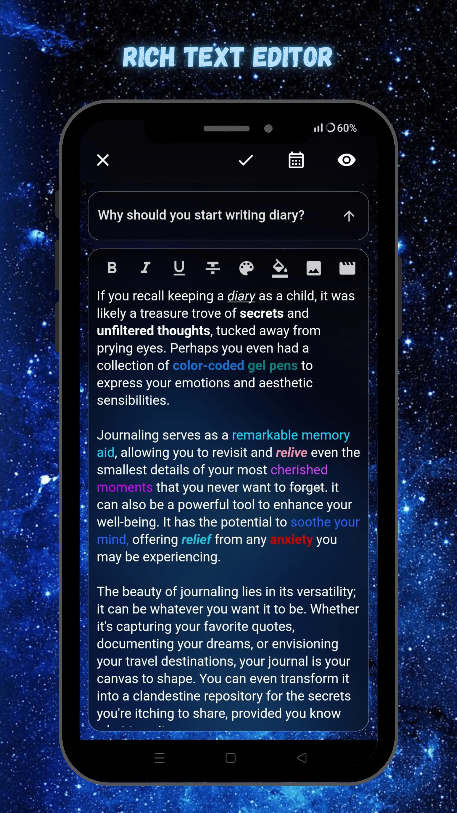
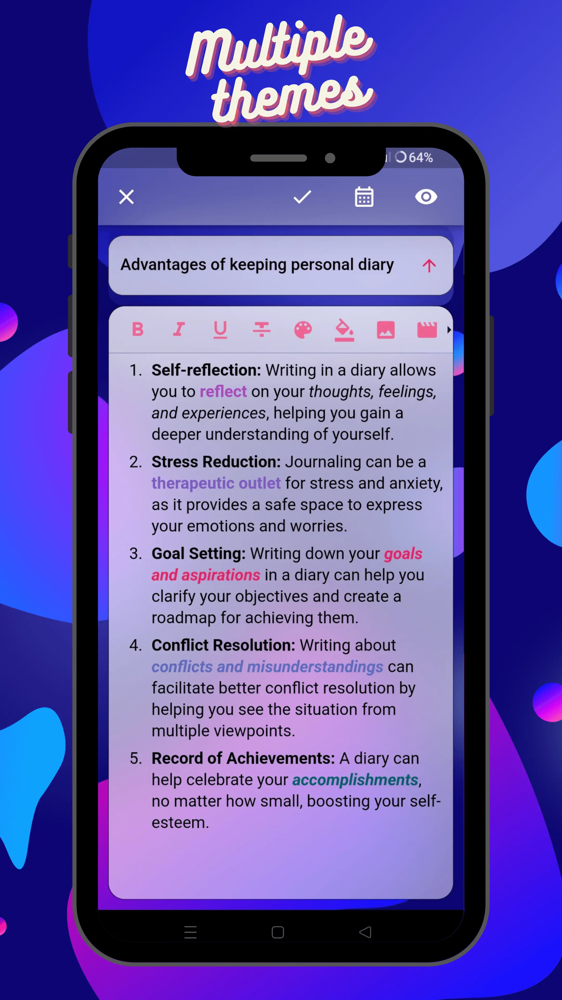
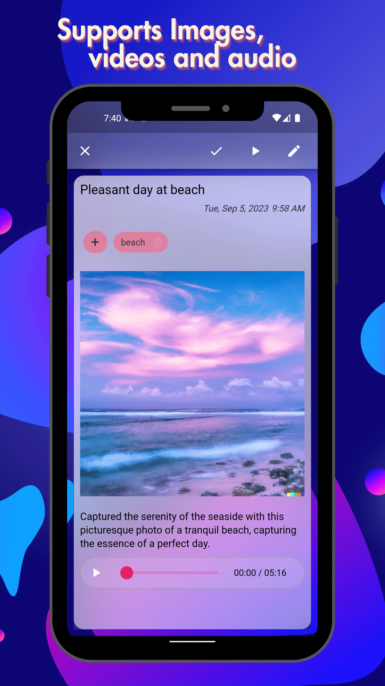
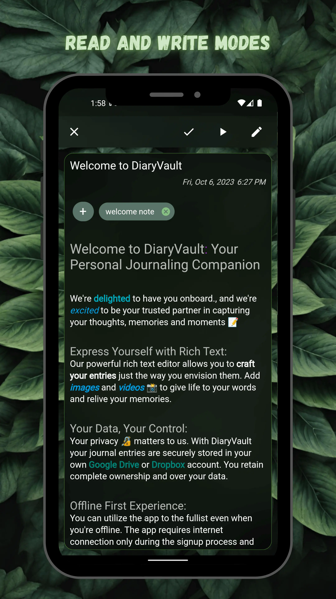
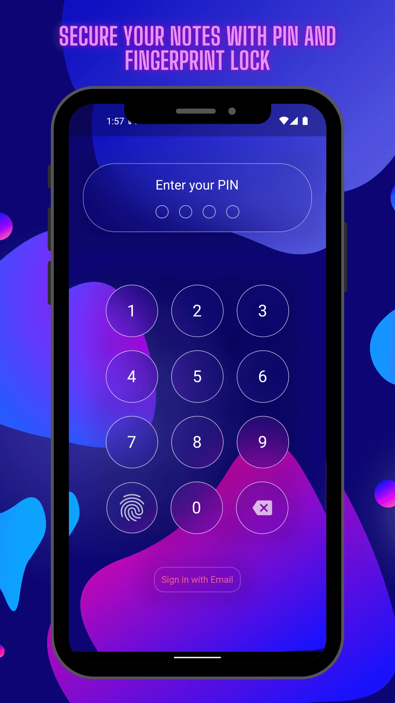
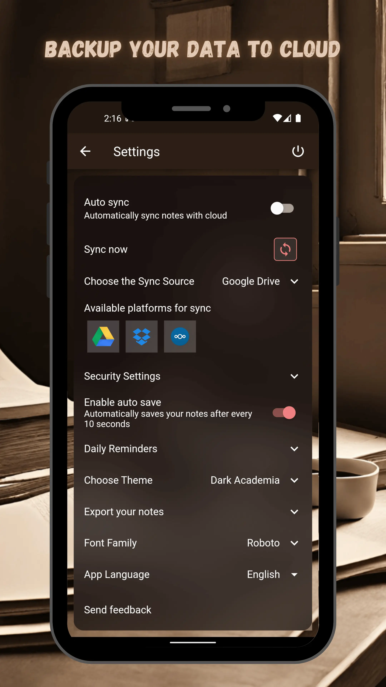
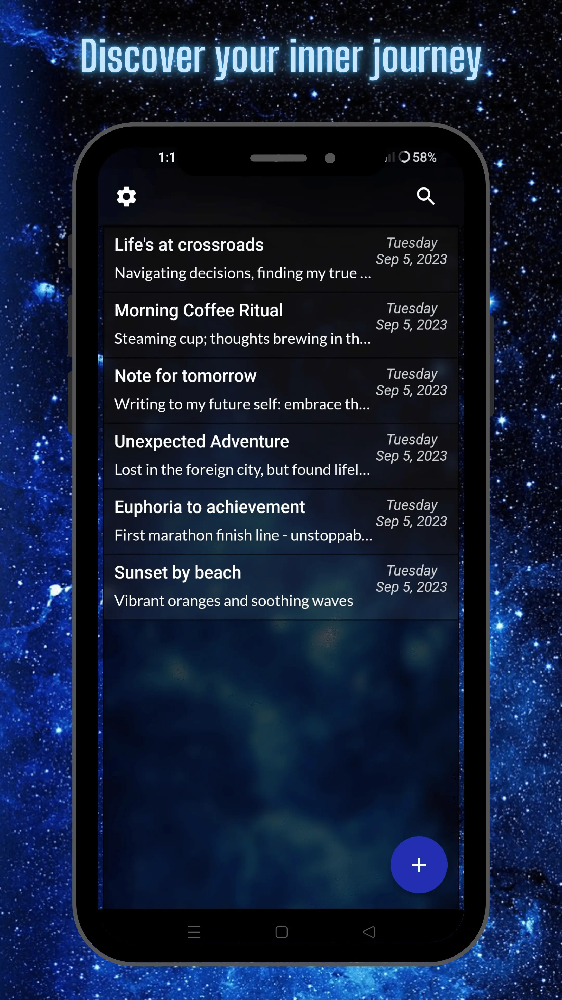
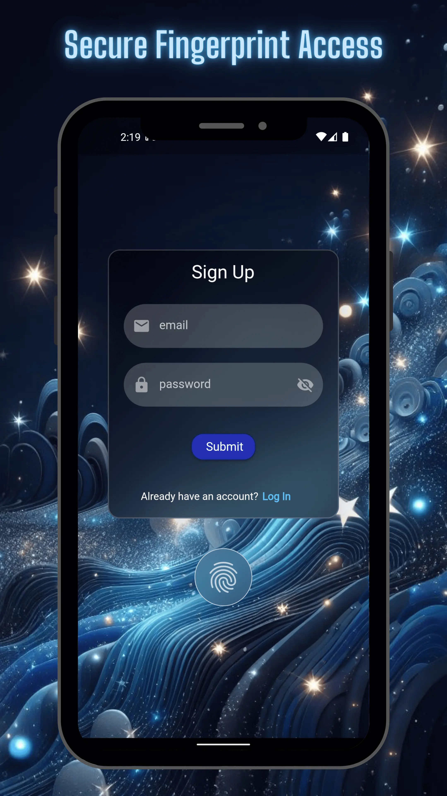

# Diary Vault

**A FOSS, offline first personal diary application written in Flutter**

<div>
  <a href="https://play.google.com/store/apps/details?id=me.sankethbk.dairyapp">
    
  </a>
</div>

<div>
  <a href="https://apt.izzysoft.de/fdroid/index/apk/me.sankethbk.dairyapp/">
    
  </a>
</div>

### Screenshots

<div style="display:flex; flex-wrap: wrap;">
  
  
  
  
  
  
  
  
</div>


### Motivation for building this app

As someone who enjoys writing in a diary, I've tried out many diary apps on Google Play.
Through my own experiences and by reading what others have shared in their reviews, I've gained a better understanding of the issues that current diary apps face.

* Requires premium subscription for seemingly simple features
* Lack of proper authentication: In some cases, users have to enter their password every time they log in, as there is no support for fingerprint authentication
* Ads are the last thing you want to encounter while writing; just picture yourself composing a thought-provoking entry, and an ad suddenly appears, disrupting your train of thought
* No support for images
* No automatic saving: People don't want to lose their lengthy notes just because they ran out of battery, received a phone call or clicked on a notification
* No font customization for overall app and individual note level
* No customizable sorting: Not everyone wants to sort by date

🌟 **If you like what we're building, please consider starring our repository on GitHub to show your support. It means a lot to us!** ⭐

## Key Features

1. **Rich text editor** with support for images, videos and audio recordings
2. **Cloud backups** to Google Drive, Dropbox or your own Nextcloud server — you keep full ownership of your data
3. **Sync data** between multiple devices via your chosen cloud provider
4. **Organize notes** with tags and flexible sorting (latest first, oldest first, A–Z)
5. **Export notes** to text and PDF files
6. **Secure your notes** with a PIN, fingerprint lock and optional end-to-end note encryption
7. **Daily reminder notifications** to stay on track with writing
8. **Automatic saving** so you never lose an entry to a call, notification or dead battery
9. **Multiple built-in themes** plus a **custom theme builder** to design your own look
10. **Font customization** for the overall app and per-note styling
11. **24 interface languages** with community-reviewed translations
12. **Read notes aloud** with text-to-speech and a selectable voice

## 🌍 Translations

DiaryVault supports **24 languages** with automated translation management:

- **Arabic (ar)**, **Bengali (bn)**, **German (de)**, **Spanish (es)**
- **Finnish (fi)**, **French (fr)**, **Gujarati (gu)**, **Hebrew (he)**
- **Hindi (hi)**, **Indonesian (id)**, **Kannada (kn)**, **Korean (ko)**
- **Nepali (ne)**, **Pashto (ps)**, **Punjabi (pa)**, **Polish (pl)**
- **Portuguese (pt)**, **Russian (ru)**, **Slovak (sk)**, **Swahili (sw)**
- **Telugu (te)**, **Turkish (tr)**, **Urdu (ur)**, **Chinese (zh)**

- **Automated System**: Missing translations are automatically generated from `intl_en.arb` using AI translation services
- **Community Contributions**: Native speakers are welcome to review and improve translations

### For Contributors: Adding/Updating Translations

We have an automated translation system that makes contributing translations easy:

```bash
cd python
./setup.sh
source venv/bin/activate
python translate_all.py --dry-run  # Check what's missing
python translate_all.py            # Generate all missing translations
```

The script discovers all `intl_<code>.arb` files in `lib/l10n` automatically, so new languages are picked up as soon as the file is added. For detailed instructions, see [`python/README.md`](python/README.md).

### Features Planned for Future Releases

- Add OneDrive as a cloud backup source.
- Organize notes using smart folders.
- Add support for stickers within the editor.


### Support

Join our [Discord server](https://discord.gg/8TTApFpNEA) to streamline the collaboration. We have a small community of contributors. We're here to assist you!

[](https://discord.gg/8TTApFpNEA)


### Contributions

For local setup and contribution guidelines, please visit [CONTRIBUTING.md](CONTRIBUTING.md).

### Documentation


Checkout our [wiki pages](https://github.com/SankethBK/diaryvault/wiki/) for documentation.
